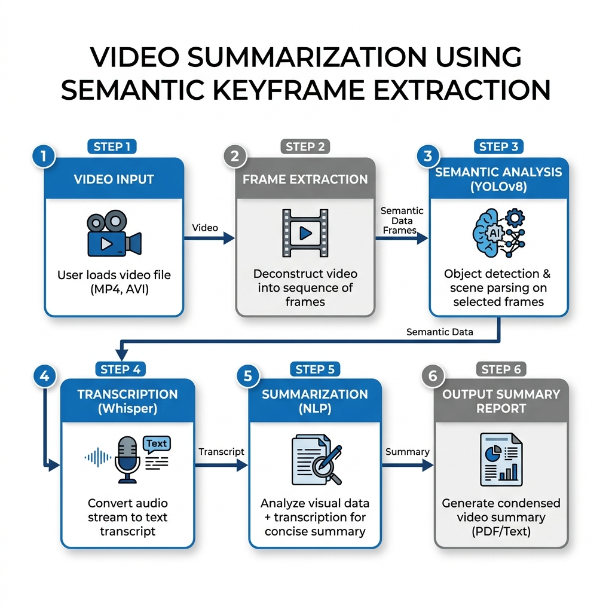
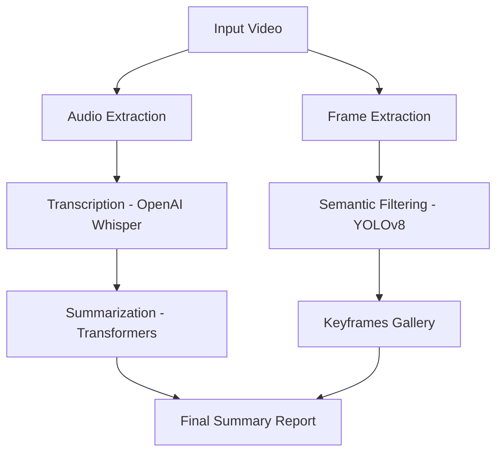

# Video Summarization using Semantic Keyframe Extraction

A modern Machine Learning pipeline designed to automatically summarize technical and educational videos by combining visual semantic analysis with audio transcription.

## 🚀 Overview

This project provides an end-to-end solution for generating concise summaries of long videos. It uses **YOLOv8** for semantic keyframe detection (identifying charts, maps, and diagrams) and **OpenAI Whisper** for high-accuracy speech-to-text transcription, followed by a **Transformer-based summarizer** to distill the core message.

## ✨ Features

- **Semantic Keyframe Extraction**: Automatically identifies and extracts frames containing meaningful visual data (e.g., Line charts, Maps, Funnel charts).
- **Speech-to-Text Transcription**: Leverages OpenAI Whisper to transcribe video audio into structured text.
- **AI-Powered Summarization**: Uses state-of-the-art NLP models to generate a readable summary from the transcription.
- **Visual Analysis**: Detects specific visual entities to categorize the video content.

## 🏗️ Architecture





## 📊 Visual Entities Detected

The system is trained to recognize various semantic elements including:
- 📈 Line-chart
- 🗺️ Geographical-Map
- 🔼 Pyramid-chart
- 📉 Column-chart
- 🍩 Doughnut-chart
- ⏳ Funnel-chart
- 🕸️ Radar-chart

## 🛠️ Setup & Installation

### Prerequisites
- Python 3.8+
- GPU (Recommended for faster inference)

### Installation
1. Clone the repository:
   ```bash
   git clone https://github.com/your-username/video-summarization.git
   cd video-summarization
   ```
2. Install dependencies:
   ```bash
   pip install -r requirements.txt
   ```

## 📖 Usage

### Running the Notebook
The main logic is contained in `complete_project.ipynb`. You can run it on **Google Colab** or locally using Jupyter:
```bash
jupyter notebook complete_project.ipynb
```

### Process Flow
1. **Upload** your video file.
2. **Configure** the frame sampling rate.
3. **Run** the cells to execute detection, transcription, and summarization.
4. **View** the generated `Final Notes` and extracted `Diagrams`.

## 📜 License

This project is licensed under the MIT License - see the [LICENSE](LICENSE) file for details.

## 📝 Acknowledgments

- [Ultralytics](https://github.com/ultralytics/ultralytics) for YOLOv8.
- [OpenAI](https://github.com/openai/whisper) for Whisper.
- [Hugging Face](https://huggingface.co/) for Transformers and NLP models.
