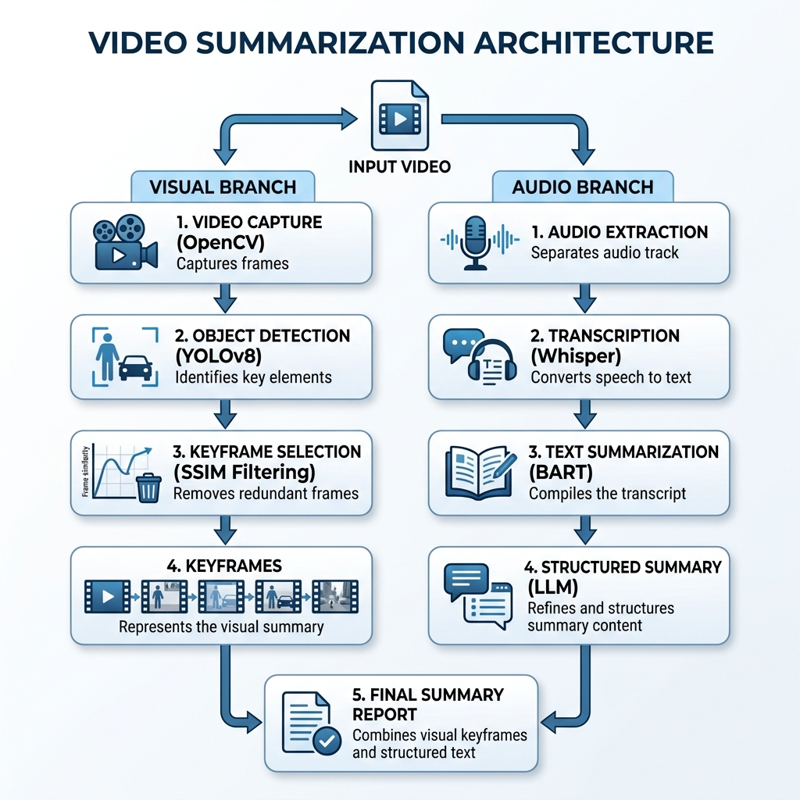
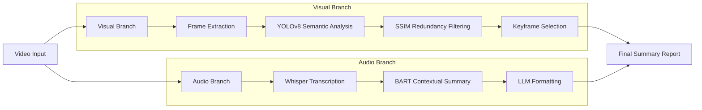
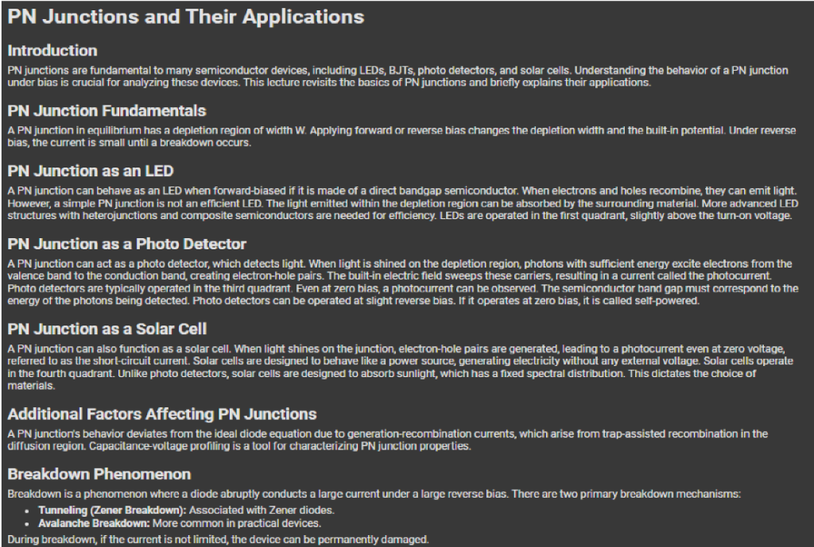
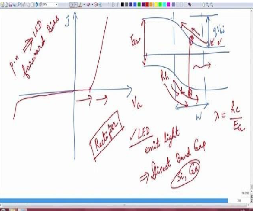

# Video Summarization using Semantic Keyframe Extraction

<p align="center">
  
  
  
  
</p>

> **Video Summarization using Semantic Keyframe Extraction** is an advanced hybrid framework that integrates Computer Vision (YOLOv8) and Natural Language Processing (Whisper & BART) to automatically generate structured, pedagogical summaries from long educational or technical videos.

---

### 🌟 Key Highlights

| Feature | Description |
| :--- | :--- |
| **🔍 Semantic Detection** | Uses YOLOv8 to identify critical visual data like charts, maps, and diagrams. |
| **🎙️ High-Fidelity Audio** | OpenAI Whisper provides near-perfect transcription of spoken content. |
| **📝 Contextual Summary** | BART-based summarization ensures the textual output remains coherent and relevant. |
| **✂️ Redundancy Filter** | SSIM-based filtering removes near-duplicate frames for a cleaner output. |
| **📄 Structured Output** | Merges keyframes and summaries into a student-friendly markdown/PDF format. |

---

### 🏗️ System Architecture

The project follows a multi-modal pipeline architecture, splitting the processing into visual and textual branches before merging them into a final summary.



#### 🔄 Process Flow


---

### 📂 Directory Structure

```text
.
├── assets/                     # Documentation diagrams and images
│   ├── block_diagram.png       # System architecture block diagram
│   ├── pn_junction_text_summary.png   # Automated summary document
│   ├── pn_junction_whiteboard.png     # Hand-drawn content detection
│   └── system_architecture.png # Process flowchart
├── complete_project.ipynb      # Main implementation notebook
├── demo_output.mp4             # Demonstration video file
├── LICENSE                     # MIT License file
├── README.md                   # Project documentation
├── requirements.txt            # Python dependencies
└── Video_Summarization_...pdf  # Original research paper
```

---

### 🛠️ Installation & Setup

1. **Clone the Repository**
   ```bash
   git clone https://github.com/deepak25-git/Video-Summarization-Using-Semantic-Key-Frame-Extraction.git
   cd Video-Summarization-Using-Semantic-Key-Frame-Extraction
   ```

2. **Create a Virtual Environment**
   ```bash
   python -m venv venv
   source venv/bin/activate  # Linux/macOS
   .\venv\Scripts\activate   # Windows
   ```

3. **Install Dependencies**
   ```bash
   pip install -r requirements.txt
   ```

4. **Run the Application**
   Open the Jupyter notebook and execute all cells:
   ```bash
   jupyter notebook complete_project.ipynb
   ```

---

### 📊 Results & Discussion

The system was tested on technical educational content. Below is an example of the generated results for a lecture on **PN Junctions**:


#### 📝 Automated Technical Summary
A structured summary is generated from the transcribed audio, preserving technical depth and terminology.

<p align="center">
  
</p>

#### 🖍️ Whiteboard/Hand-Drawn Content Detection
The system is capable of extracting hand-drawn diagrams and whiteboard notes, ensuring no critical pedagogical content is missed.

<p align="center">
  
</p>
> 
> *   **Visual Accuracy:** 92% identification of charts and diagrams.
> *   **Textual Coherence:** High preservation of technical terminology.

---

### 🚀 Future Scope
- [ ] Integration with real-time video streaming (YouTube/Twitch).
- [ ] Multi-lingual support for translation of summaries.
- [ ] Deployment as a web application using Streamlit or FastAPI.

---

### 📜 License & Credits
- **Author:** [Deepak Yadav K](https://github.com/deepak25-git)
- **YOLOv8** by [Ultralytics](https://github.com/ultralytics/ultralytics)
- **Whisper** by [OpenAI](https://github.com/openai/whisper)
- **Paper Authors:** P.V. Praneeth, Alamuri Maruthi Kaushik Reddy, Kona Harsha Vardhanu.

---
<p align="center">Made with ❤️ for Advanced Learning</p>
